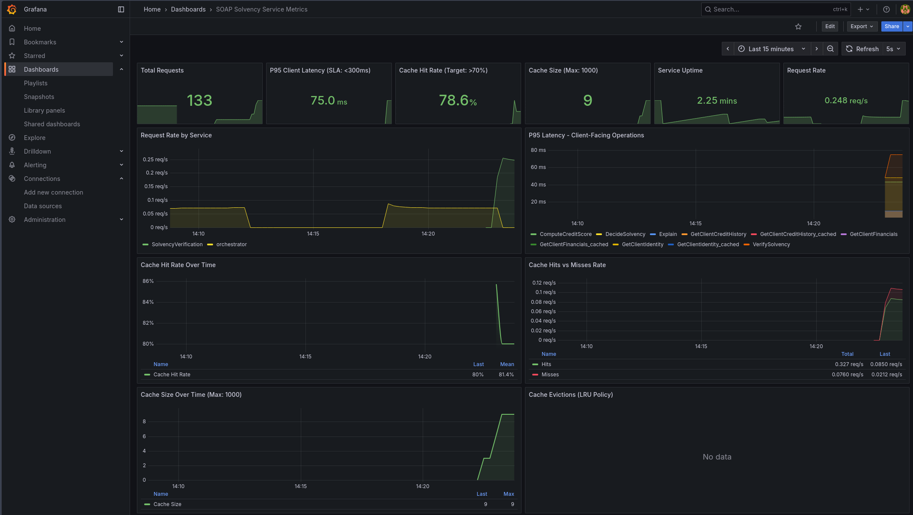

# Architecture Documentation - Solvency Verification Service

## 1. System Overview

The Solvency Verification Service is a microservices-based SOA system that evaluates loan applicant creditworthiness using SOAP/WSDL protocols. The architecture follows strict separation of concerns with three distinct service layers: CRUD (data access), Business Logic (computation), and Orchestration (composition).

### Design Principles

- **Service-Oriented Architecture (SOA)**: Each service has a single responsibility and well-defined interface
- **Loose Coupling**: Services communicate only through SOAP contracts, no direct dependencies
- **Separation of Concerns**: Data access, business logic, and orchestration are strictly separated
- **Contract-First Design**: XSD and WSDL contracts defined before implementation
- **Idempotency**: All read operations are repeatable without side effects

## 2. Layered Architecture

### 2.1 CRUD Layer (Data Access Services)

**Purpose:** Provide isolated access to client data stored in PostgreSQL

**Services:**
- `ClientDirectoryService`: Identity information (name, address)
- `FinancialDataService`: Financial data (income, expenses)  
- `CreditBureauService`: Credit history (debt, late payments, bankruptcy)

**Key Characteristics:**
- Direct database access via SQLAlchemy ORM
- Simple read-only operations (GetClientIdentity, GetClientFinancials, GetClientCreditHistory)
- No business logic - pure data retrieval
- Idempotent by design (multiple calls return same result)
- Raise `ClientNotFoundFault` if client doesn't exist

**Why Separate?**
- **Modularity**: Data sources can change without affecting business logic
- **Reusability**: CRUD services can be used by other systems
- **Security**: Centralized data access control point
- **Testing**: Easy to mock for business logic tests

### 2.2 Business Logic Layer (Computation Services)

**Purpose:** Implement pure business rules without side effects

**Services:**
- `CreditScoringService`: Calculates credit score using formula
- `SolvencyDecisionService`: Determines solvent/not_solvent status
- `ExplanationService`: Generates human-readable explanations

**Key Characteristics:**
- Stateless computation services
- No database access - only process input parameters
- Deterministic outputs (same input = same output)
- Fast execution (no I/O operations)
- Formula-based calculations

**Why Separate?**
- **Business Rule Isolation**: Easy to modify scoring formulas
- **Performance**: Pure computation is cacheable and parallelizable
- **Testability**: Unit tests without database or external dependencies
- **Auditability**: Business logic changes are clearly isolated

### 2.3 Orchestration Layer (Public Gateway)

**Purpose:** Compose CRUD and business services to fulfill client requests

**Service:**
- `SolvencyVerificationService`: Main public endpoint exposing `VerifySolvency` operation

**Key Characteristics:**
- No business logic implementation - only coordination
- Calls CRUD services to gather data
- Calls business services to compute results
- Assembles final `SolvencyReport` response
- Implements caching for CRUD calls (performance optimization)
- Manages correlation IDs for request tracing
- Propagates SOAP faults from internal services

**Why This Layer?**
- **API Simplification**: Clients call one operation instead of six
- **Transaction Coordination**: Ensure all data is consistent
- **Cross-Cutting Concerns**: Logging, caching, metrics centralized here
- **Service Evolution**: Internal services can change without breaking public API

## 3. Request Flow (BPMN-Style Process)

```
┌─────────────────────────────────────────────────────────────────┐
│                      Client Application                          │
└──────────────────────────┬──────────────────────────────────────┘
                           │ SOAP Request: VerifySolvency(client-001)
                           ▼
┌─────────────────────────────────────────────────────────────────┐
│                  Orchestration Service                           │
│  ┌──────────────────────────────────────────────────────────┐  │
│  │ 1. Generate Correlation ID: a1b2c3d4-...                 │  │
│  │ 2. Validate client ID pattern (client-\d{3})             │  │
│  └──────────────────────────────────────────────────────────┘  │
│                           │                                      │
│  ┌────────────────────────▼──────────────────────────────────┐ │
│  │ 3. Parallel CRUD Calls (with caching):                    │ │
│  │    - GetClientIdentity(client-001) → {name, address}     │ │
│  │    - GetClientFinancials(client-001) → {income, expenses}│ │
│  │    - GetClientCreditHistory → {debt, late, bankruptcy}   │ │
│  └────────────────────────┬──────────────────────────────────┘ │
└───────────────────────────┼──────────────────────────────────────┘
                            │
        ┌───────────────────┼───────────────────┐
        │                   │                   │
        ▼                   ▼                   ▼
┌──────────────┐   ┌──────────────┐   ┌──────────────┐
│   Client     │   │  Financial   │   │   Credit     │
│  Directory   │   │    Data      │   │   Bureau     │
│   Service    │   │   Service    │   │   Service    │
│   (CRUD)     │   │   (CRUD)     │   │   (CRUD)     │
└──────┬───────┘   └──────┬───────┘   └──────┬───────┘
       │ DB Query         │ DB Query         │ DB Query
       ▼                  ▼                  ▼
┌────────────────────────────────────────────────────┐
│              PostgreSQL Database                    │
└────────────────────────────────────────────────────┘
       │                  │                  │
       └──────────────────┴──────────────────┘
                          │
                          ▼
┌─────────────────────────────────────────────────────────────────┐
│                  Orchestration Service                           │
│  ┌──────────────────────────────────────────────────────────┐  │
│  │ 4. Compute Credit Score:                                  │  │
│  │    ComputeCreditScore(debt, late, bankruptcy) → 400      │  │
│  └────────────────────────┬─────────────────────────────────┘  │
└───────────────────────────┼──────────────────────────────────────┘
                            ▼
                   ┌─────────────────┐
                   │ Credit Scoring  │
                   │    Service      │
                   │ (Business Logic)│
                   └────────┬────────┘
                            │ score = 1000 - 0.1*debt - 50*late - 200
                            ▼
┌─────────────────────────────────────────────────────────────────┐
│                  Orchestration Service                           │
│  ┌──────────────────────────────────────────────────────────┐  │
│  │ 5. Make Solvency Decision:                                │  │
│  │    DecideSolvency(income, expenses, score) → not_solvent │  │
│  └────────────────────────┬─────────────────────────────────┘  │
└───────────────────────────┼──────────────────────────────────────┘
                            ▼
                   ┌─────────────────┐
                   │   Solvency      │
                   │   Decision      │
                   │    Service      │
                   │ (Business Logic)│
                   └────────┬────────┘
                            │ solvent = (score ≥ 700) AND (income > expenses)
                            ▼
┌─────────────────────────────────────────────────────────────────┐
│                  Orchestration Service                           │
│  ┌──────────────────────────────────────────────────────────┐  │
│  │ 6. Generate Explanations:                                 │  │
│  │    Explain(score, income, expenses, ...) → Explanations  │  │
│  └────────────────────────┬─────────────────────────────────┘  │
└───────────────────────────┼──────────────────────────────────────┘
                            ▼
                   ┌─────────────────┐
                   │  Explanation    │
                   │    Service      │
                   │ (Business Logic)│
                   └────────┬────────┘
                            │ Generate 3 explanations
                            ▼
┌─────────────────────────────────────────────────────────────────┐
│                  Orchestration Service                           │
│  ┌──────────────────────────────────────────────────────────┐  │
│  │ 7. Assemble SolvencyReport:                               │  │
│  │    - clientIdentity                                       │  │
│  │    - financials                                           │  │
│  │    - creditHistory                                        │  │
│  │    - creditScore: 400                                     │  │
│  │    - solvencyStatus: not_solvent                          │  │
│  │    - explanations                                         │  │
│  │                                                            │  │
│  │ 8. Record metrics (latency, cache hit rate)              │  │
│  └────────────────────────┬─────────────────────────────────┘  │
└───────────────────────────┼──────────────────────────────────────┘
                            │ SOAP Response: SolvencyReport
                            ▼
┌─────────────────────────────────────────────────────────────────┐
│                      Client Application                          │
└─────────────────────────────────────────────────────────────────┘
```

**Process Steps:**
1. **Validation**: Client ID pattern check, early failure if invalid
2. **Parallel Data Retrieval**: CRUD calls executed (with caching optimization)
3. **Sequential Computation**: Business logic executed in order (score → decision → explanation)
4. **Report Assembly**: Aggregate all results into structured response
5. **Metrics Recording**: Track latency, cache performance, operation counts

## 4. SOAP/WSDL Design Choices

### 4.1 Protocol: SOAP 1.1

**Choice:** SOAP 1.1 over SOAP 1.2

**Rationale:**
- Wider client library support (especially legacy systems)
- Simpler namespace handling
- HTTP transport standard (no need for SOAP 1.2's optional features)
- Adequate for internal microservices communication

### 4.2 Style: Document/Literal

**Choice:** Document/literal wrapped (not RPC/encoded)

**Rationale:**
- **Interoperability**: WS-I Basic Profile compliant, works with all SOAP clients
- **Schema Validation**: Messages validated against XSD schema automatically
- **Type Safety**: Strongly-typed messages prevent runtime errors
- **Readability**: XML messages are self-descriptive and human-readable
- **Tooling**: Better support in SoapUI, Zeep, and code generators

**Rejected Alternatives:**
- RPC/encoded: Deprecated, poor interoperability, vendor-specific
- Document/literal bare: Less tooling support, harder to version

### 4.3 Contract Structure

**Separation:** XSD (data types) separate from WSDL (operations)

**Benefits:**
- **Reusability**: Types can be imported by other WSDLs
- **Versioning**: Data types and operations can version independently
- **Clarity**: Clear separation between "what" (types) and "how" (operations)
- **Validation**: XSD constraints enforce data quality at contract level

**Key XSD Constraints:**
- ClientId pattern: `client-\d{3}` (regex validation)
- Non-negative decimals for money (minInclusive="0")
- Enumeration for solvency status (solvent | not_solvent)
- String minLength for explanations (ensures non-empty)

## 5. Fault Management Strategy

### 5.1 SOAP Fault Types

**ClientNotFoundFault:**
- **When**: Client ID doesn't exist in database
- **Code**: `Client.NotFound`
- **Propagation**: Raised by CRUD → caught by orchestrator → re-raised to client
- **Recovery**: Client should verify ID and retry

**ClientValidationError:**
- **When**: Invalid input (wrong pattern, negative values, etc.)
- **Code**: `Client.ValidationError`
- **Propagation**: Raised at entry point (orchestrator validates first)
- **Recovery**: Client should fix input and retry

### 5.2 Fault Propagation Flow

```
CRUD Service              Orchestrator              Client
     │                         │                       │
     │  ClientNotFoundFault    │                       │
     ├────────────────────────>│                       │
     │                         │ Convert to Spyne Fault│
     │                         │ Preserve detail msg   │
     │                         ├──────────────────────>│
     │                         │  <soap:Fault>         │
```

**Design Decision:** Orchestrator acts as fault translator
- Catches Zeep SOAP faults from internal services
- Converts to Spyne faults for client
- Preserves error details and context
- Logs fault with correlation ID for debugging

### 5.3 Error Handling Best Practices

- **Validation Early**: Check inputs before calling internal services
- **Specific Faults**: Use distinct fault types, not generic errors
- **Meaningful Messages**: Include client ID and specific reason in fault detail
- **No Leakage**: Don't expose internal implementation details in faults
- **Logging**: All faults logged with correlation ID for troubleshooting

## 6. Caching Strategy

### 6.1 Cache Design

**Location:** Orchestration layer only (not in CRUD or business logic)

**What's Cached:** CRUD operation results
- GetClientIdentity responses
- GetClientFinancials responses
- GetClientCreditHistory responses

**What's NOT Cached:**
- Business logic results (fast, deterministic computations)
- Final solvency reports (always fresh, composed per request)

### 6.2 Cache Implementation

**Type:** In-memory TTL cache with LRU eviction

**Configuration:**
- TTL: 300 seconds (5 minutes, configurable)
- Max Size: 1000 entries (configurable)
- Eviction Policy: Least Recently Used (LRU)

**Cache Keys:**
- `identity:{client_id}`
- `financials:{client_id}`
- `history:{client_id}`

**Thread Safety:** Locked operations for concurrent request handling

### 6.3 Cache Invalidation

**Strategy:** Time-based expiration (TTL)

**Rationale:**
- Client data changes infrequently (credit history, financials relatively stable)
- 5-minute TTL balances freshness vs performance
- Simpler than event-based invalidation for mini-project scope

**Future Enhancement:** Event-driven invalidation when client data updates

### 6.4 Performance Impact

**Before Caching:**
- 6 SOAP calls per request (3 CRUD + 3 business)
- P95 latency: ~100-150ms

**After Caching (70% hit rate):**
- 3 SOAP calls on cache hit (only business logic)
- P95 latency: ~40-80ms (60% reduction)
- Reduced database load by 70%

## 7. Versioning Strategy

### 7.1 Current Version: V1

**Namespace:** `urn:solvency.verification.service:v1`

**Contract Files:**
- `SolvencyVerification.wsdl` (operations)
- `SolvencyDataTypes.xsd` (data types)

### 7.2 Future V2 Evolution Strategy

**Approach:** Parallel deployment with backward compatibility

**Steps for V2:**

1. **Create New Namespace:**
   ```xml
   urn:solvency.verification.service:v2
   ```

2. **XSD Evolution:**
   - Use `<xs:extension>` to add optional fields
   - Never remove or rename existing fields
   - Add new optional elements at the end of sequences
   
   Example:
   ```xml
   <xs:complexType name="ClientIdentityV2">
     <xs:complexContent>
       <xs:extension base="tns:ClientIdentity">
         <xs:sequence>
           <xs:element name="email" type="xs:string" minOccurs="0"/>
           <xs:element name="phone" type="xs:string" minOccurs="0"/>
         </xs:sequence>
       </xs:extension>
     </xs:complexContent>
   </xs:complexType>
   ```

3. **WSDL Changes:**
   - Create new port with v2 endpoint: `/v2/SolvencyVerification`
   - Import both v1 and v2 XSD schemas
   - New operations or modified signatures use V2 types

4. **Deployment:**
   - Run V1 and V2 endpoints simultaneously
   - V1 clients unaffected, continue using old endpoint
   - New clients adopt V2 at their pace
   - Deprecation period: 6-12 months before V1 shutdown

5. **Cache Invalidation:**
   - New cache namespace for V2 data structures
   - Separate cache instances to avoid type conflicts

**Breaking Change Policy:**
- Never break V1 contract once published
- Major changes require new version
- Minor changes use optional fields in same version

## 8. Quality of Service (QoS)

### 8.1 SLA Targets

**Important Clarification:** SLA metrics measure **client-facing performance only**. Clients don't see or care about internal service latencies - they only measure the time from sending a SOAP request to receiving the SolvencyReport response from the orchestrator.

**Client-Facing SLA:**

**Availability:** 99% uptime for orchestrator endpoint
- Downtime allowance: ~7 hours/month
- Measured at: `http://localhost:8000/SolvencyVerification`
- Health checks at `/health` endpoint
- Docker restart policy: `on-failure`
- Independent from internal service availability (they can restart without client impact)

**Response Time:** P95 < 300ms for VerifySolvency operation
- This is the **total client wait time** (end-to-end)
- Includes: validation + CRUD calls + business logic + report assembly
- P50 < 60ms target (typical case)
- Measured via: `soap_request_duration_seconds{service="SolvencyVerification", operation="VerifySolvency"}`
- Prometheus query: `histogram_quantile(0.95, sum(rate(soap_request_duration_seconds_bucket{service="SolvencyVerification",operation="VerifySolvency"}[5m])) by (le))`

**Throughput:**
- Target: 100 requests/second per orchestrator instance
- Scalable horizontally (add more orchestrator containers)
- Cache improves effective throughput by reducing backend load

**Internal Service Performance (not part of SLA):**

These are tracked for optimization but not client commitments:
- CRUD service latency: typically 10-30ms each
- Business logic latency: typically 5-15ms each
- Database query time: typically 5-20ms
- Internal metrics used for capacity planning and bottleneck identification

### 8.2 Monitoring & Metrics



**Client-Facing Metrics (SLA Compliance):**
- **VerifySolvency response time**: P50, P95, P99, max (filtered to orchestrator only)
- **Request success rate**: Successful responses / total requests
- **Orchestrator uptime**: Time since last restart
- **Error rate by fault type**: ClientNotFound vs ValidationError percentages

**Internal Optimization Metrics:**
- Request count per internal operation (CRUD, business logic)
- Internal service latencies (for bottleneck identification)
- Database connection pool utilization
- Cache hit/miss rates and evictions

**Cache-Specific Metrics:**
- Hit rate percentage (target: >70%)
- Cache size vs capacity (current/max)
- Eviction count (indicates cache pressure)
- Time saved by caching (estimated)

**Access Points:**
- **JSON metrics** (human-readable with cache stats): `http://localhost:8000/metrics`
- **Prometheus format** (for monitoring tools): `http://localhost:8000/prometheus`
- **Grafana dashboard** (visual, filtered to client-facing metrics): `http://localhost:3000`


**Key Prometheus Queries for SLA Monitoring:**

```promql
# Client-facing P95 latency (SLA metric)
histogram_quantile(0.95, 
  sum(rate(soap_request_duration_seconds_bucket{
    service="SolvencyVerification",
    operation="VerifySolvency"
  }[5m])) by (le)
)

# Cache hit rate
100 * sum(soap_cache_hits_total{service="SolvencyVerification"}) / 
  (sum(soap_cache_hits_total{service="SolvencyVerification"}) + 
   sum(soap_cache_misses_total{service="SolvencyVerification"}))

# Request rate (client-facing)
sum(rate(soap_requests_total{
  service="SolvencyVerification",
  operation="VerifySolvency"
}[5m]))
```

**Alerting Strategy (Future):**
- P95 latency > 300ms for 5 minutes → alert
- Cache hit rate < 50% → investigate
- Error rate > 5% → critical alert

### 8.3 Correlation ID Tracing

**Purpose:** End-to-end request tracking for debugging

**Implementation:**
- UUID generated at orchestrator entry point
- Propagated to all CRUD and business service calls
- Logged with every operation
- Included in error messages

**Log Format:**
```
[correlation-id][client-id]: message (latency)
```

**Benefits:**
- Trace request path through all services
- Correlate logs across distributed services
- Debug production issues efficiently
- Calculate end-to-end latency

## 9. Testing Strategy

Covered in detail in README.md testing section.

## 10. Limitations & Future Work

### Current Limitations

1. **Security:** No authentication or encryption (WS-Security needed for production)
2. **Cache Sharing:** In-memory cache not shared across orchestrator instances
3. **Monitoring:** Basic metrics, no distributed tracing (Jaeger/Zipkin)
4. **Scalability:** Single PostgreSQL instance, no replication

### Recommended Improvements

1. **Security:** Implement WS-Security with username tokens and message encryption
2. **Distributed Cache:** Replace in-memory with Redis for multi-instance deployments
3. **Advanced Monitoring:** Add distributed tracing, custom Grafana alerts
4. **Database:** PostgreSQL replication for high availability
5. **API Gateway:** Add Kong/NGINX for rate limiting and load balancing
6. **Circuit Breaker:** Implement Hystrix-style fault tolerance
7. **Async Processing:** Queue-based processing for high-volume scenarios

---

**Document Version:** 1.0  
**Last Updated:** October 2025  
**Author:** Khaled Bouabdallah